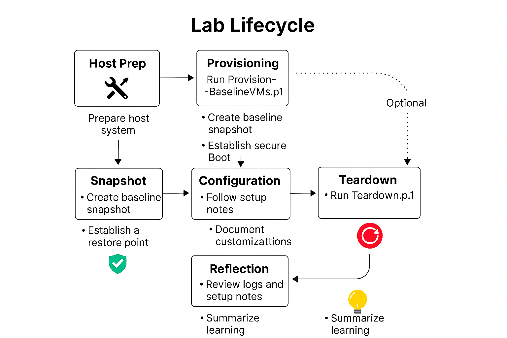

# Baseline VM Lab for SC-300 and Beyond

A modular, reproducible Hyper-V lab designed for security certification prep, enterprise simulation, and beginner-friendly learning. This project was rebuilt from the ground up to support clean provisioning, full teardown, and lifecycle hygiene—with clear documentation and step-by-step guidance.

---

## Script Philosophy

These scripts are built for clarity, reproducibility, and real learning.  
Each one is modular, beginner-friendly, and aligned with certification-grade lifecycle hygiene.  
Whether you're provisioning your first VM or automating teardown across dozens, this toolkit is designed to teach through transparency.

---

## Quickstart (3 Steps)

1. **Prepare your external SSD**
   - Format it clean (NTFS recommended)
   - Create a root folder called `BaselineVM`

2. **Copy ISOs**
   - Place your Windows 11 Enterprise and Windows Server 2022 Eval ISOs into:
     ```
     P:\BaselineVM\ISOs\
     ```

3. **Run the provisioning and prep scripts**
   - Open PowerShell as Administrator
   - Navigate to `P:\BaselineVM\Scripts`
   - Run:
     ```powershell
     .\HostPrep.ps1
	 .\Provision-BaselineVMs.ps1
     ```

---

## Automation Coverage

This lab includes PowerShell scripts for:

- Host preparation and network optimization
- VM provisioning with snapshot hygiene
- Full teardown and cleanup
- Future modules for snapshot rotation, menu-driven launchers, and log management

---

## Available Scripts

### `HostPrep.ps1`
  
Automates host-side configuration before VM provisioning.

**Tasks performed:**
- Disables Large Send Offload v2 (IPv4/IPv6)
- Validates presence of Hyper-V Default Switch
- Supports dry-run mode via `-WhatIf`

**Usage:**
```powershell
.\HostPrep.ps1
```

---

### `Provision-BaselineVMs.ps1`

Creates baseline virtual machines for SC-300 lab using Windows 11 and Server 2022 ISOs.

**Tasks performed:**

- Provisions Generation 2 VMs with predefined names and specs
- Attaches ISO media and disables Secure Boot
- Creates dynamic VHDs and configures VM firmware
- Logs provisioning actions to Logs\ProvisionLog.txt
- Supports snapshot hygiene and lifecycle reproducibility
- For advanced provisioning with custom specs, see Provision-CustomVMs.ps1

**Usage:**

```powershell
.\Provision-BaselineVMs.ps1
```

---

### `Provision-CustomVMs.ps1`

Provisions VMs dynamically using a JSON config file.

**Tasks performed:**
- Reads VM definitions from `Configs\vm-config.json`
- Supports custom names, memory, disk size, and ISO mapping
- Logs provisioning actions for auditability

**Usage:**

```powershell
.\Provision-CustomVMs.ps1
```

---

### `Teardown.ps1`

Performs full lifecycle cleanup of lab resources.

**Tasks performed:**

- Deletes VMs and associated checkpoints
- Removes virtual hard disks and switches
- Logs teardown actions to TeardownLogs\TeardownLog.txt

**Usage:**

```powershell
.\Teardown.ps1
```

---

## Before You Begin

- Hyper-V must be enabled
- A virtual switch named `Lab-External Switch` must exist
- ISO files must be named:
  - `Win11_Enterprise.iso`
  - `WinServer2022_Eval.iso`
- PowerShell must be run as Administrator

---

## Lab Lifecycle

This lab supports a full learning lifecycle: **Provision → Snapshot → Configure → Teardown → Reflect**

- **Host Prep**: [`Scripts/HostPrep.ps1`](./Scripts/HostPrep.ps1)
- **Provisioning**: [`Scripts/Provision-BaselineVMs.ps1`](./Scripts/Provision-BaselineVMs.ps1)
- **Snapshot**: Documented in [`Docs/CleanBaseline.md`](./Docs/CleanBaseline.md)
- **Configuration**: Tracked in [`Docs/SetupNotes.md`](./Docs/SetupNotes.md)
- **Teardown**: [`Scripts/Teardown.ps1`](./Scripts/Teardown.ps1)
- **Reflection**: Summarized in [`TeardownLogs/DecommissionLog.md`](./TeardownLogs/DecommissionLog.md)

---

## Folder Structure

| Folder         | Purpose                                                  |
|----------------|----------------------------------------------------------|
| CertPrep       | SC-300 exercises, artifacts, and certification prep      |
| Configs        | VM specs, provisioning parameters, and role definitions  |
| Docs           | Setup notes, lifecycle diagrams, troubleshooting logs    |
| Exports        | Exported configs or assets for sharing or rollback       |
| Scripts        | PowerShell automation for provisioning and teardown      |
| Snapshots      | Metadata or notes about Hyper-V checkpoints              |
| TeardownLogs   | Logs from teardown runs, useful for auditing             |
| Templates      | Role-based provisioning templates and README scaffolding |

> Additional folders such as Backups/, Logs/, and Staging/ are scaffolded but currently empty.
 
---

## Educational Goals

- Build a repeatable lab for SC-300 and related certification prep
- Practice provisioning, teardown, snapshotting, and export workflows
- Learn PowerShell scripting through real-world automation
- Share modular, beginner-friendly tools with others
- Model lifecycle hygiene and reproducibility for enterprise simulation

---

## Additional Documentation

See [`RepoMap.md`](./Docs/RepoMap.md) explains folder structure and lifecycle roles  
See [`RepoHygiene.md`](./Docs/RepoHygiene.md) details exclusions, backup strategy, and `.gitignore` logic

---

## Common Errors & Fixes

See [`Docs/README.md`](./Docs/README.md) for a full walkthrough and troubleshooting guide.

---

## Project Roadmap

See [`Docs/ROADMAP.md`](./Docs/ROADMAP.md) for planned features, cert prep modules, and long-term goals.

---

## Lifecycle Flowchart



---

## Contributing

> This lab is designed to grow with its users.
  
> If you'd like to suggest improvements, contribute scripts, or adapt it for other certifications, feel free to fork, clone, or open a pull request.  

> All contributions that improve clarity, reproducibility, or learner experience are welcome.

